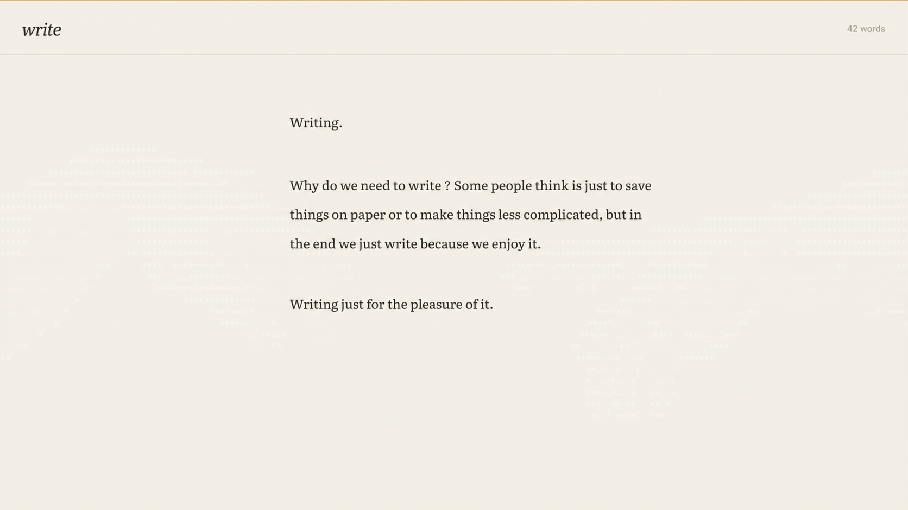

# Write

> A tiny, native Linux app for the joy of writing.



Write opens to one quiet page. It saves plain text, gets out of the way, and
keeps every control behind a shortcut.

## Made for writing

- A centred, paper-like writing column set in Literata.
- Plain UTF-8 `.txt` files—choose where they live.
- Quiet autosave and one recovery copy (`your-file.txt~`).
- Find, focus mode, text-size controls, and a warm dark theme.
- Your cursor position is remembered for each document.

There are no accounts, cloud services, databases, web views, formatting
toolbars, document libraries, or telemetry.

The executable is roughly 36 KB. GTK remains a normal system dependency; it is
never bundled into a huge application package.

## Build and run

Write uses C++20 and GTK4 (version 4.10 or newer).

On Arch Linux:

```sh
sudo pacman -S --needed base-devel gtk4
make
sudo make install
```

On another Linux distribution, install a C++ compiler, GNU Make, `pkg-config`,
and the GTK4 development package, then run the same last two commands.

Launch it with:

```sh
write
```

To run it from the source tree without installing it:

```sh
make run
```

Use `PREFIX=... make install` for a different install prefix.

## Keyboard shortcuts

- `Enter` — new paragraph (with breathing room)
- `Shift` + `Enter` — new line
- `Ctrl` + `O` — open a text file
- `Ctrl` + `S` — save immediately
- `Ctrl` + `Shift` + `S` — choose where to save
- `Ctrl` + `F` — find text; `Enter` finds next, `Shift` + `Enter` finds previous, `Esc` closes
- `Ctrl` + `+` / `Ctrl` + `=` — increase text size
- `Ctrl` + `-` — decrease text size
- `Ctrl` + `0` — reset text size
- `Ctrl` + `Shift` + `D` — switch warm light/dark paper
- `Ctrl` + `Shift` + `I` — show the active writing typeface
- `F11` — focus mode (fullscreen, no header)

## Data and portability

Your writing is ordinary text and remains portable independently of the app.
Until you use Save As, the default document is stored at
`~/.local/share/write/document.txt`; its cursor-position metadata lives only in
the matching app-data folder. Copy the `.txt` file anywhere; it needs no Write
database to remain yours.

## License

MIT. See [LICENSE](LICENSE).

Literata is bundled under the SIL Open Font License 1.1; see
[assets/OFL.txt](assets/OFL.txt).
